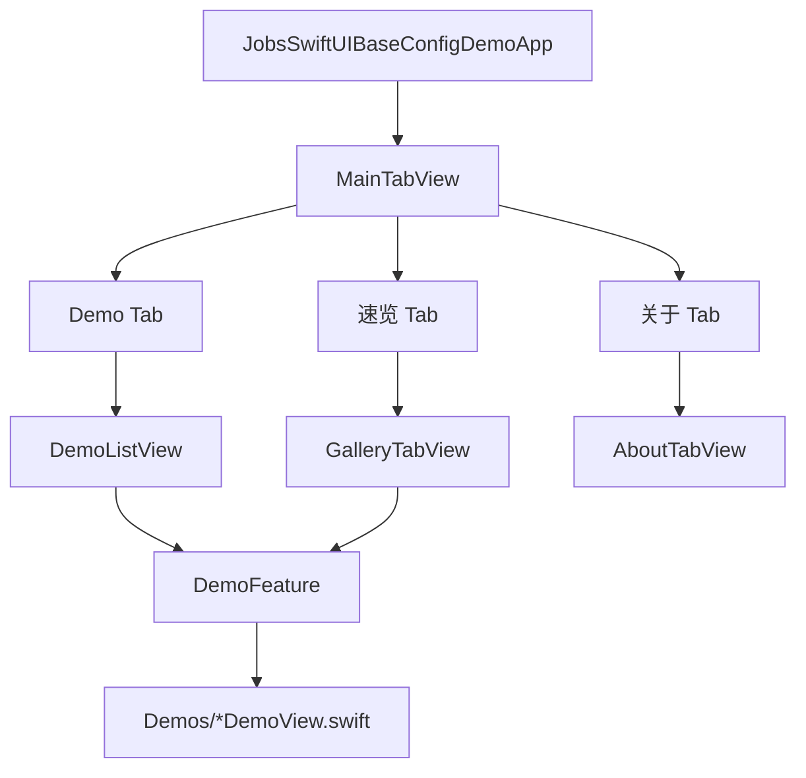
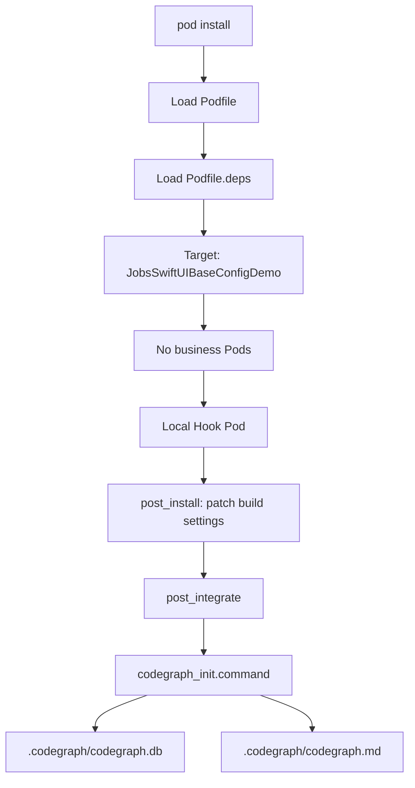

# `JobsSwiftUIBaseConfigDemo`


[toc]

---

## 🔥 <font id=前言>前言</font>

`JobsSwiftUIBaseConfigDemo` 是一个纯原生 [**Swift**](https://www.swift.org/) / [**SwiftUI**](https://developer.apple.com/xcode/swiftui/) iOS Demo 工程，用来集中演示系统 UI 组件和常见交互写法。

工程入口模拟 iOS 新工程的基础结构：启动后先进入主 `TabView`，其中 `Demo` Tab 是功能列表，点击列表功能名后通过 `NavigationStack` 推出对应 Demo 页面。

本工程业务代码不依赖任何 Pod，也不引入第三方 UI 库，适合作为 SwiftUI 系统组件学习、Jobs SwiftUI 基座验证和 Demo 页面扩展模板。

工程仍保留 [**CocoaPods**](https://cocoapods.org/) 入口：`Podfile` 只负责加载解耦后的 `Podfile.deps`，并在 `pod install` 收尾阶段挂载 CodeGraph 脚本生成 `.codegraph`。`Podfile.deps` 只声明一个本地脚本锚点 Pod，不向 App 业务层提供 UI / 网络 / 工具能力。

## 一、工程信息 <a href="#前言" style="font-size:17px; color:green;"><b>🔼</b></a> <a href="#🔚" style="font-size:17px; color:green;"><b>🔽</b></a>

| 项目 | 说明 |
| --- | --- |
| 工作区文件 | `./JobsSwiftUIBaseConfigDemo.xcworkspace` |
| 工程文件 | `./JobsSwiftUIBaseConfigDemo.xcodeproj` |
| App 入口 | `./JobsSwiftUIBaseConfigDemo/JobsSwiftUIBaseConfigDemoApp.swift` |
| 主 Tab 容器 | `./JobsSwiftUIBaseConfigDemo/MainTabView.swift` |
| Demo 列表 | `./JobsSwiftUIBaseConfigDemo/DemoListView.swift` |
| Demo 注册表 | `./JobsSwiftUIBaseConfigDemo/DemoFeature.swift` |
| Demo 页面目录 | `./JobsSwiftUIBaseConfigDemo/Demos/` |
| Podfile 入口 | `./Podfile` |
| Pod 依赖清单 | `./Podfile.deps` |
| Pod 挂载脚本 | `./ScriptsByPods/` |
| 脚本锚点 Pod | `./ScriptsByPods/JobsSwiftUICodeGraphHook/` |
| Bundle ID | `com.jobs.jobsswiftuibaseconfigdemo` |
| 最低系统 | iOS `17.0` |
| 支持平台 | `iphoneos` / `iphonesimulator` |
| 依赖方式 | 无业务 Pod 依赖；仅保留本地脚本锚点 Pod |

## 二、目录结构 <a href="#前言" style="font-size:17px; color:green;"><b>🔼</b></a> <a href="#🔚" style="font-size:17px; color:green;"><b>🔽</b></a>

```text
.
├── README.md
├── icon.png
├── Podfile
├── Podfile.deps
├── ScriptsByPods
│   ├── README.md
│   ├── JobsSwiftUICodeGraphHook
│   ├── codegraph_init.command
│   └── codegraph_export_md.command
├── JobsSwiftUIBaseConfigDemo.xcworkspace
├── JobsSwiftUIBaseConfigDemo.xcodeproj
└── JobsSwiftUIBaseConfigDemo
    ├── Assets.xcassets
    ├── JobsSwiftUIBaseConfigDemoApp.swift
    ├── MainTabView.swift
    ├── DemoListView.swift
    ├── DemoFeature.swift
    ├── DemoFeatureRow.swift
    ├── GalleryTabView.swift
    ├── AboutTabView.swift
    └── Demos
        ├── TextImageDemoView.swift
        ├── ButtonMenuDemoView.swift
        ├── InputFieldsDemoView.swift
        ├── ControlValuesDemoView.swift
        ├── PickersDemoView.swift
        ├── ProgressGaugeDemoView.swift
        ├── CustomCircularGaugeView.swift
        ├── ListFormDemoView.swift
        ├── NavigationDemoView.swift
        ├── DirectionalPushDemoView.swift
        ├── AlertDialogDemoView.swift
        ├── PresentationDemoView.swift
        ├── LayoutDemoView.swift
        ├── TabPageDemoView.swift
        ├── DisclosureOutlineDemoView.swift
        ├── AsyncLinkShareDemoView.swift
        ├── AnimationDemoView.swift
        └── TimerDemoView.swift
```

## 三、入口流程 <a href="#前言" style="font-size:17px; color:green;"><b>🔼</b></a> <a href="#🔚" style="font-size:17px; color:green;"><b>🔽</b></a>



主流程说明：

- `JobsSwiftUIBaseConfigDemoApp` 使用 `WindowGroup` 加载 `MainTabView`。
- `MainTabView` 使用 `TabView` 提供 `Demo`、`速览`、`关于` 三个 Tab。
- `DemoListView` 使用 `NavigationStack`、`List`、`NavigationLink` 组织功能列表。
- `DemoFeature` 是 Demo 注册表，集中维护功能名、描述、图标和目标页面。
- `Demos/` 目录下每个文件对应一个独立演示页面。

## 四、功能清单 <a href="#前言" style="font-size:17px; color:green;"><b>🔼</b></a> <a href="#🔚" style="font-size:17px; color:green;"><b>🔽</b></a>

| 功能名 | 演示内容 | 对应文件 |
| --- | --- | --- |
| `Text / Label / Image` | 文本、`Label`、SF Symbols 与基础图片展示 | `./JobsSwiftUIBaseConfigDemo/Demos/TextImageDemoView.swift` |
| `Button / Menu / ControlGroup` | 按钮样式、菜单、按钮组和角色按钮 | `./JobsSwiftUIBaseConfigDemo/Demos/ButtonMenuDemoView.swift` |
| `TextField / SecureField / TextEditor` | 单行输入、密码输入、多行文本和键盘焦点 | `./JobsSwiftUIBaseConfigDemo/Demos/InputFieldsDemoView.swift` |
| `Toggle / Slider / Stepper` | 开关、滑杆、步进器等数值交互 | `./JobsSwiftUIBaseConfigDemo/Demos/ControlValuesDemoView.swift` |
| `Picker / DatePicker / ColorPicker` | 分段选择、滚轮选择、日期和颜色选择 | `./JobsSwiftUIBaseConfigDemo/Demos/PickersDemoView.swift` |
| `ProgressView / Gauge` | 进度条、加载指示器、线性 Gauge 和自定义圆形 Gauge | `./JobsSwiftUIBaseConfigDemo/Demos/ProgressGaugeDemoView.swift` |
| `List / Form / Section` | 列表、表单、分组和只读信息行 | `./JobsSwiftUIBaseConfigDemo/Demos/ListFormDemoView.swift` |
| `NavigationStack / Toolbar` | 导航推出、工具栏按钮和层级页面 | `./JobsSwiftUIBaseConfigDemo/Demos/NavigationDemoView.swift` |
| `Directional Push VC` | 从上、下、左、右四个方向按百分比 Push 页面 | `./JobsSwiftUIBaseConfigDemo/Demos/DirectionalPushDemoView.swift` |
| `Alert / ConfirmationDialog` | 系统弹窗、确认弹窗和破坏性操作 | `./JobsSwiftUIBaseConfigDemo/Demos/AlertDialogDemoView.swift` |
| `Sheet / Popover / FullScreenCover` | 模态页面、浮层和全屏展示 | `./JobsSwiftUIBaseConfigDemo/Demos/PresentationDemoView.swift` |
| `ScrollView / LazyVGrid / Grid` | 滚动容器、自适应网格和新式 `Grid` | `./JobsSwiftUIBaseConfigDemo/Demos/LayoutDemoView.swift` |
| `TabView 分页` | 分页 `TabView` 和索引切换 | `./JobsSwiftUIBaseConfigDemo/Demos/TabPageDemoView.swift` |
| `DisclosureGroup / OutlineGroup` | 折叠分组和树形结构 | `./JobsSwiftUIBaseConfigDemo/Demos/DisclosureOutlineDemoView.swift` |
| `AsyncImage / Link / ShareLink` | 远程图片、外链打开和系统分享 | `./JobsSwiftUIBaseConfigDemo/Demos/AsyncLinkShareDemoView.swift` |
| `Animation / Transition` | 状态驱动动画、转场和显隐 | `./JobsSwiftUIBaseConfigDemo/Demos/AnimationDemoView.swift` |
| `Timer 定时器` | 非 UI 控件：`Timer.publish`、`autoconnect` 和 `onReceive` | `./JobsSwiftUIBaseConfigDemo/Demos/TimerDemoView.swift` |

## 五、重点实现 <a href="#前言" style="font-size:17px; color:green;"><b>🔼</b></a> <a href="#🔚" style="font-size:17px; color:green;"><b>🔽</b></a>

### 5.1、TabBar 结构

`MainTabView` 使用 SwiftUI 的 `TabView` 实现主 TabBar：

```swift
TabView(selection: $selectedTab) {
    DemoListView()
        .tabItem {
            Label("Demo", systemImage: "list.bullet.rectangle")
        }
        .tag(AppTab.demos)
}
```

### 5.2、列表推出 Demo 页面

`DemoListView` 通过 `NavigationStack` 包住 `List`，每个功能项都是一个 `NavigationLink`：

```swift
NavigationLink {
    feature.destination
        .navigationTitle(feature.title)
        .navigationBarTitleDisplayMode(.inline)
} label: {
    DemoFeatureRow(feature: feature)
}
```

首页列表支持长按 cell 后拖拽排序，排序结果通过 `AppStorage` 写入 `UserDefaults`。再次进入 `DemoListView` 时，会优先读取已保存顺序；新增 Demo 未出现在旧顺序里时会自动追加到列表末尾。

### 5.3、自定义双色圆形 Gauge

`CustomCircularGaugeView` 用 `Circle().trim(...)` 分别绘制两段弧线：

- 已走过的弧线使用 `completedColor`，默认蓝色。
- 未走过的弧线使用 `remainingColor`，默认浅灰。
- 小圆点根据 `progress` 计算角度和坐标，跟随当前进度移动。

这个写法用于解决系统 `Gauge` 圆形样式不方便细分“走过 / 未走过”颜色的问题。

### 5.4、Timer 定时器

`TimerDemoView` 使用 `Timer.publish(every:on:in:)` 创建发布器，并通过 `onReceive` 每秒更新页面状态：

```swift
private let ticker = Timer.publish(every: 1, on: .main, in: .common).autoconnect()
```

### 5.5、四向 Push 预览

`DirectionalPushDemoView` 使用分段选择控制 Push 方向，使用 `Slider` 控制 Push 百分比，并在预览区域模拟从上、下、左、右四个方向进入目标 VC 页面。

## 六、Podfile 边界 <a href="#前言" style="font-size:17px; color:green;"><b>🔼</b></a> <a href="#🔚" style="font-size:17px; color:green;"><b>🔽</b></a>

### 6.1、当前定位

`Podfile` 存在是为了和兄弟工程保持一致的工程维护入口：

- `Podfile` 负责 CocoaPods 基础配置、加载 `Podfile.deps`、挂载 `post_integrate` 脚本。
- `Podfile.deps` 当前只声明 `JobsSwiftUIBaseConfigDemo` target 和 `JobsSwiftUICodeGraphHook` 本地脚本锚点 Pod。
- `JobsSwiftUICodeGraphHook` 只用于让 CocoaPods 完整走 install 生命周期，不在 SwiftUI Demo 业务代码中 `import`。
- `ScriptsByPods/codegraph_init.command` 在 `pod install` 完成后后台生成 `.codegraph/codegraph.db`。
- `ScriptsByPods/codegraph_export_md.command` 从数据库导出 `.codegraph/codegraph.md/`。

### 6.2、执行流程



### 6.3、脚本日志

| 日志 | 说明 |
| --- | --- |
| 系统临时目录中的 `codegraph_init.async.log` | `pod install` 启动的 CodeGraph 后台流程日志 |
| 系统临时目录中的 `codegraph_init.log` | CodeGraph 初始化 / 同步日志 |
| 系统临时目录中的 `codegraph_export_md.log` | Markdown 导出日志 |
| 系统临时目录中的 `codegraph_export_md.async.log` | 后台导出日志 |

## 七、运行方式 <a href="#前言" style="font-size:17px; color:green;"><b>🔼</b></a> <a href="#🔚" style="font-size:17px; color:green;"><b>🔽</b></a>

### 7.1、使用 Xcode 运行

1. 使用 [**Xcode**](https://developer.apple.com/xcode) 打开工作区：

   ```shell
   open ./JobsSwiftUIBaseConfigDemo.xcworkspace
   ```

2. 选择 `JobsSwiftUIBaseConfigDemo` Scheme。

3. 选择任意 iOS Simulator。

4. 点击 Run。

### 7.2、使用命令行编译

```shell
xcodebuild \
  -workspace ./JobsSwiftUIBaseConfigDemo.xcworkspace \
  -scheme JobsSwiftUIBaseConfigDemo \
  -configuration Debug \
  -destination 'generic/platform=iOS Simulator' \
  CODE_SIGNING_ALLOWED=NO \
build
```

### 7.3、生成 CodeGraph

首次需要 CocoaPods 工作区或需要刷新 `.codegraph` 时，在工程根目录执行：

```shell
pod install
```

执行后会生成 / 更新：

- `./JobsSwiftUIBaseConfigDemo.xcworkspace`
- `./Pods/`
- `./Podfile.lock`
- `./.codegraph/`

`Pods/` 是 CocoaPods 生成物，不是业务依赖来源；当前 `Podfile.deps` 只声明 `JobsSwiftUICodeGraphHook` 这个本地脚本锚点 Pod。

## 八、扩展 Demo <a href="#前言" style="font-size:17px; color:green;"><b>🔼</b></a> <a href="#🔚" style="font-size:17px; color:green;"><b>🔽</b></a>

新增一个 Demo 页面时，按下面顺序处理：

1. 在 `./JobsSwiftUIBaseConfigDemo/Demos/` 下新增独立 Swift 文件，保持一个文件一个主 `View`。

2. 在 `DemoFeature` 中新增 `case`。

3. 在 `title`、`subtitle`、`symbol` 中补齐列表展示信息。

4. 在 `destination` 中绑定目标页面。

5. 确认新文件已加入 `JobsSwiftUIBaseConfigDemo` target。

6. 使用 `xcodebuild` 或 [**Xcode**](https://developer.apple.com/xcode) 编译验证。

## 九、注意事项 <a href="#前言" style="font-size:17px; color:green;"><b>🔼</b></a> <a href="#🔚" style="font-size:17px; color:green;"><b>🔽</b></a>

- SwiftUI Demo 页面不依赖任何业务 Pod；不要为了系统 UI 演示随手往 `Podfile.deps` 增加业务依赖。
- `pod install` 的主要价值是生成 / 刷新 `.codegraph`，以及保持和兄弟工程一致的 CocoaPods 生命周期入口。
- `AsyncImage` 页面依赖网络图片，网络不可用时会显示失败占位。
- `Assets.xcassets/AppIcon.appiconset` 保留了 AppIcon 资源槽，正式发布前需要补齐图标素材。
- 当前工程面向 Demo 演示，不包含登录、网络层、持久化、权限申请和发布签名配置。
- 命令行编译示例使用 `CODE_SIGNING_ALLOWED=NO`，适合本地模拟器构建；真机运行需要按实际开发者账号配置签名。

## 十、排查方式 <a href="#前言" style="font-size:17px; color:green;"><b>🔼</b></a> <a href="#🔚" style="font-size:17px; color:green;"><b>🔽</b></a>

| 现象 | 处理方式 |
| --- | --- |
| Xcode 打不开工程 | 优先打开 `./JobsSwiftUIBaseConfigDemo.xcworkspace`；未执行过 `pod install` 时再打开 `./JobsSwiftUIBaseConfigDemo.xcodeproj` |
| 找不到新增 Demo 页面 | 确认新文件已加入 target，并已在 `DemoFeature.destination` 注册 |
| Demo 列表排序不符合预期 | 删除 App 后重装，或清空 `JobsSwiftUIBaseConfigDemo.demoFeatureOrder` 对应的 `UserDefaults` 值 |
| 命令行编译提示签名问题 | 模拟器构建命令加上 `CODE_SIGNING_ALLOWED=NO` |
| `pod install` 后没有 `.codegraph` | 查看系统临时目录中的 `codegraph_init.async.log` |
| 只想验证 Podfile，不想启动 CodeGraph | 执行 `JOBS_SKIP_CODEGRAPH=1 pod install --no-repo-update` |
| 不想刷新 CodeGraph | 只用 `xcodebuild` 或 Xcode 运行工程，不执行 `pod install` |
| 远程图片加载失败 | 检查网络，或观察 `AsyncImage` 的失败占位是否正常展示 |
| 自定义 Gauge 颜色不符合预期 | 修改 `CustomCircularGaugeView` 的 `completedColor` 和 `remainingColor` |

<a id="🔚" href="#前言" style="font-size:17px; color:green; font-weight:bold;">我是有底线的➤点我回到首页</a>
