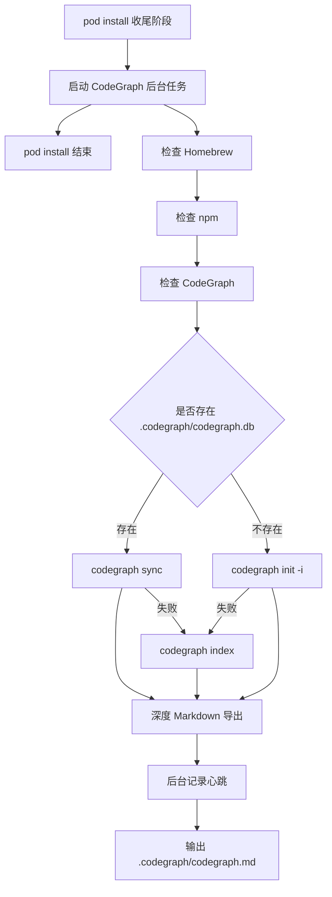

# `codegraph_init.command`


[toc]

---

## 🔥 <font id=前言>前言</font>

`codegraph_init.command` 用于在 `pod install` 收尾阶段完成 CodeGraph 初始化 / 同步，并调用 `codegraph_export_md.command` 导出深度 [**Markdown**](https://markdown.cn) / [**Mermaid**](https://mermaid.js.org) 项目关系图谱。

这版重点解决三个问题：

- `pod install` 进入 CodeGraph 阶段后只负责启动后台任务，不再等待索引和导出完成。
- 后台流程内会定时记录导出心跳和最近日志，方便排查长时间任务。
- 默认不再硬筛 `calls,extends,implements`，而是交给导出脚本根据数据库实际 `edge kind` 自动生成有内容的报告。

---

## 一、执行流程 <a href="#前言" style="font-size:17px; color:green;"><b>🔼</b></a> <a href="#🔚" style="font-size:17px; color:green;"><b>🔽</b></a>



---

## 二、运行方式 <a href="#前言" style="font-size:17px; color:green;"><b>🔼</b></a> <a href="#🔚" style="font-size:17px; color:green;"><b>🔽</b></a>

- 授权：

  ```shell
  chmod +x ScriptsByPods/codegraph_init.command/codegraph_init.command
  chmod +x ScriptsByPods/codegraph_export_md.command/codegraph_export_md.command
  ```

- 正常执行：

  ```shell
  pod install
  ```

  `pod install` 只会输出后台 PID 和日志路径，不会等待 CodeGraph 完成。重复执行时，如果上一个后台任务仍在运行，不会再启动第二个。

- 查看后台进度：

  ```shell
  tail -f $TMPDIR/codegraph_init.async.log
  ```

---

## 三、后台心跳 <a href="#前言" style="font-size:17px; color:green;"><b>🔼</b></a> <a href="#🔚" style="font-size:17px; color:green;"><b>🔽</b></a>

CodeGraph 后台流程默认不设置超时，并每 `10s` 将心跳写入日志：

```text
CodeGraph Markdown 深度导出仍在运行：30s；PID=xxx；日志=$TMPDIR/codegraph_export_md.log
```

可配置：

| 变量 | 默认值 | 说明 |
| --- | --- | --- |
| `CODEGRAPH_EXPORT_HEARTBEAT_SECONDS` | `10` | 心跳间隔 |
| `CODEGRAPH_EXPORT_TIMEOUT_SECONDS` | `0` | 导出超时，`0` 表示不超时 |
| `CODEGRAPH_EXPORT_ASYNC` | `0` | `1` 表示后台导出 |

---

## 四、导出参数 <a href="#前言" style="font-size:17px; color:green;"><b>🔼</b></a> <a href="#🔚" style="font-size:17px; color:green;"><b>🔽</b></a>

| 变量 | 默认值 | 说明 |
| --- | --- | --- |
| `CODEGRAPH_MD_OUT_DIR` | `.codegraph/codegraph.md` | 输出目录 |
| `CODEGRAPH_MD_EDGE_KINDS` | `auto` | 自动根据数据库实际边类型导出 |
| `CODEGRAPH_MD_EDGE_SCAN_LIMIT` | `20000` | 扫描边数上限 |
| `CODEGRAPH_MD_EDGE_EXPORT_LIMIT` | `5000` | 明细导出边数上限 |
| `CODEGRAPH_MD_GRAPH_EDGE_LIMIT` | `25` | 单张符号图边数 |
| `CODEGRAPH_MD_GRAPH_DIRECTION` | `LR` | 图方向 |

- 更完整导出：

  ```shell
  CODEGRAPH_MD_EDGE_SCAN_LIMIT=100000 \
  CODEGRAPH_MD_EDGE_EXPORT_LIMIT=20000 \
  pod install
  ```

- 只更新数据库，不导出文档：

  ```shell
  CODEGRAPH_SKIP_EXPORT=1 pod install
  ```

---

## 五、日志文件 <a href="#前言" style="font-size:17px; color:green;"><b>🔼</b></a> <a href="#🔚" style="font-size:17px; color:green;"><b>🔽</b></a>

| 日志 | 说明 |
| --- | --- |
| `$TMPDIR/codegraph_init.async.log` | `pod install` 启动的完整后台流程日志 |
| `$TMPDIR/codegraph_init.log` | 初始化 / 同步 / 调度日志 |
| `$TMPDIR/codegraph_export_md.log` | 前台导出日志 |
| `$TMPDIR/codegraph_export_md.async.log` | 后台导出日志 |

<a id="🔚" href="#前言" style="font-size:17px; color:green; font-weight:bold;">我是有底线的➤点我回到首页</a>
